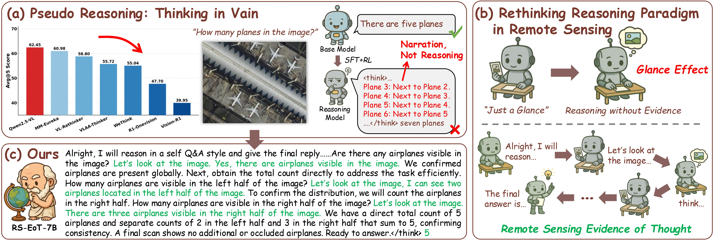

<div align="center">

# Asking like Socrates: Socrates Helps VLMs Understand Remote Sensing Images

<a href='https://arxiv.org/abs/2511.22396'></a>
<a href='https://huggingface.co/ShaoRun/RS-EoT-7B'></a>
<a href='https://huggingface.co/datasets/ShaoRun/RS-EoT-4K'></a>
<a href='https://geox-lab.github.io/Asking_like_Socrates/'></a>

**Run Shao**<sup>1,2,\*</sup>, **Ziyu Li**<sup>1,\*</sup>, **Zhaoyang Zhang**<sup>1</sup>, **Linrui Xu**<sup>1</sup>, **Xinran He**<sup>2</sup>, **Hongyuan Yuan**<sup>1,2</sup>,<br> **Bolei He**<sup>2</sup>, **Yongxing Dai**<sup>2</sup>, **Yiming Yan**<sup>3</sup>, **Yijun Chen**<sup>3</sup>, **Wang Guo**<sup>1</sup>, **Haifeng Li**<sup>1,†</sup>

<sup>1</sup>School of Geosciences and Info-Physics, Central South University, Changsha, China<br>
<sup>2</sup>Baidu Inc., Beijing, China<br>
<sup>3</sup>School of Earth Sciences, Zhejiang University, Hangzhou, China

</div>

## 📖 Abstract

Recent multimodal reasoning models have significantly advanced vision-language systems. However, in remote sensing (RS) tasks, we observe widespread **pseudo reasoning**: models narrate the process of reasoning rather than genuinely reason toward the correct answer based on visual evidence. We attribute this to the **Glance Effect**, where a single, coarse perception of large-scale RS imagery results in incomplete understanding.

To address this, we propose **RS-EoT** (Remote Sensing Evidence-of-Thought), a language-driven, iterative visual evidence-seeking paradigm. To instill this paradigm, we propose **SocraticAgent**, a self-play multi-agent system that synthesizes reasoning traces via alternating cycles of reasoning and visual inspection. Furthermore, we propose a two-stage progressive RL strategy (Grounding then VQA) to enhance and generalize these patterns.

<div align="center">
  
</div>

## 🚀 Quick Start

You can easily access our dataset and run inference with our pretrained model using Hugging Face.

### Dataset Loading

Load the **RS-EoT-4K** dataset directly using the `datasets` library.

```python
import datasets
import random

# Load the dataset from Hugging Face
data = datasets.load_dataset("ShaoRun/RS-EoT-4K")

# Print dataset structure
print(data)

# Print a random sample
print(random.choice(data['train']))
```

### Model Inference (RS-EoT-7B)

#### Installation

Ensure you have the latest `transformers` and `qwen-vl-utils` installed:

```bash
pip install transformers qwen-vl-utils
```

#### 1\. Visual Question Answering (VQA)

This example demonstrates how to ask the model a question and receive a reasoning-backed answer.

```python
from transformers import Qwen2_5_VLForConditionalGeneration, AutoTokenizer, AutoProcessor
from qwen_vl_utils import process_vision_info
import torch

# Load model and processor
model_name = "ShaoRun/RS-EoT-7B"
model = Qwen2_5_VLForConditionalGeneration.from_pretrained(
    model_name, torch_dtype="auto", device_map="auto"
)
processor = AutoProcessor.from_pretrained(model_name)

# Define input image (assumes demo.jpg is in the current directory)
image_path = "./assets/demo.jpg" 

messages = [
    {
        "role": "user",
        "content": [
            {"type": "image", "image": image_path},
            {"type": "text", "text": "How many cars in this image?"},
        ],
    }
]

# Preparation for inference
text = processor.apply_chat_template(
    messages, tokenize=False, add_generation_prompt=True
)
image_inputs, video_inputs = process_vision_info(messages)
inputs = processor(
    text=[text],
    images=image_inputs,
    videos=video_inputs,
    padding=True,
    return_tensors="pt",
)
inputs = inputs.to("cuda")

# Inference
generated_ids = model.generate(**inputs, max_new_tokens=4096)
generated_ids_trimmed = [
    out_ids[len(in_ids) :] for in_ids, out_ids in zip(inputs.input_ids, generated_ids)
]
output_text = processor.batch_decode(
    generated_ids_trimmed, skip_special_tokens=True, clean_up_tokenization_spaces=False
)

print(output_text[0])
```

#### 2\. Visual Grounding with Visualization

This example shows how to perform visual grounding, parse the coordinates, and visualize the output bounding boxes.

```python
import re
import torch
from PIL import Image, ImageDraw, ImageFont
from transformers import Qwen2_5_VLForConditionalGeneration, AutoProcessor
from qwen_vl_utils import process_vision_info

# --- Helper Functions for Parsing and Visualization ---

def extract_bbox_list_in(text: str) -> list[list[float]]:
    """Extracts bounding boxes from the model output text."""
    boxes = []
    text = re.sub(r'\\([{}\[\]":,])', r'\1', text)
    # Pattern to find lists of numbers like [x1, y1, x2, y2]
    pattern = re.compile(r'\[\s*(.*?)\s*\]', flags=re.IGNORECASE | re.DOTALL)
    matches = pattern.findall(text)
    
    number_pattern = r'-?\d+\.\d+|-?\d+'
    for match in matches:
        nums = re.findall(number_pattern, match)
        if len(nums) >= 4:
            # Take the first 4 numbers as the box
            box = [float(num) for num in nums[:4]]
            boxes.append(box)
    return boxes

def visualize_bboxes(img: Image.Image, boxes: list[list[float]], color=(0, 255, 0), width=3) -> Image.Image:
    """Draws bounding boxes on the image."""
    out = img.copy()
    draw = ImageDraw.Draw(out)
    W, H = img.size
    
    for b in boxes:
        if len(b) < 4: continue
        x1, y1, x2, y2 = b[:4]
        
        # Ensure coordinates are within bounds
        x1, y1 = max(0, min(W-1, x1)), max(0, min(H-1, y1))
        x2, y2 = max(0, min(W-1, x2)), max(0, min(H-1, y2))
        
        # Draw rectangle with thickness
        draw.rectangle([x1, y1, x2, y2], outline=color, width=width)
        
    return out

# --- Main Inference Code ---

model_name = "ShaoRun/RS-EoT-7B"
model = Qwen2_5_VLForConditionalGeneration.from_pretrained(
    model_name, torch_dtype="auto", device_map="auto"
)
processor = AutoProcessor.from_pretrained(model_name)

# Load Image
image_path = "./assets/demo.jpg"
image = Image.open(image_path).convert('RGB')

messages = [
    {
        "role": "user",
        "content": [
            {"type": "image", "image": image},
            {"type": "text", "text": 'Locate the black car parked on the right in the remote sensing image. Return the coordinates as "[x1, y1, x2, y2]".'},
        ],
    }
]

# Process Inputs
text = processor.apply_chat_template(messages, tokenize=False, add_generation_prompt=True)
image_inputs, video_inputs = process_vision_info(messages)
inputs = processor(
    text=[text],
    images=image_inputs,
    videos=video_inputs,
    padding=True,
    return_tensors="pt",
)
inputs = inputs.to("cuda")

# Generate
generated_ids = model.generate(**inputs, max_new_tokens=4096)
generated_ids_trimmed = [
    out_ids[len(in_ids) :] for in_ids, out_ids in zip(inputs.input_ids, generated_ids)
]
response = processor.batch_decode(
    generated_ids_trimmed, skip_special_tokens=True, clean_up_tokenization_spaces=False
)[0]

print(f"Model Response:\n{response}")

# Parse and Visualize
# Extract reasoning and answer. Note: RS-EoT-7B uses <think> tags.
answer_part = response.split("</think>")[-1] 
detection = extract_bbox_list_in(answer_part)

if detection:
    print(f"Detected BBoxes: {detection}")
    vis_img = visualize_bboxes(image, detection)
    vis_img.save("./res.jpg")
    print("Visualization saved to ./res.jpg")
else:
    print("No bounding boxes detected in the response.")
```

## 📂 Code Structure

This repository is organized into three main components, covering the entire pipeline from data synthesis to SFT and RL training.

### 1. SocraticAgent: RS-EoT Trajectory Synthesis
A self-play multi-agent system (**Reasoner** & **Perceiver**) designed to synthesize high-quality reasoning traces. It implements the "Asking like Socrates" method to generate the **RS-EoT-4K** dataset.

👉 [**Go to SocraticAgent Directory**](./SocraticAgent)

---

### 2. LLaMA-Factory: SFT Cold-Start
We use LLaMA-Factory for the Supervised Fine-Tuning (SFT) stage to cold-start the reasoning capability.

#### Environment Setup
```bash
conda create -n als_sft python=3.12 -y
conda activate als_sft
cd LLaMA-Factory
pip install -e ".[torch,metrics]" --no-build-isolation
````

#### Data Preprocessing

If using **RS-EoT-4K**:

```bash
python LLaMA-Factory/als_run/proc/data2llamafactory.py
```

If using **your own data**, refer to the LLaMA-Factory documentation to convert your data into the supported SFT format.


Modify the dataset path in `LLaMA-Factory/data/dataset_info.json`.

#### Training

```bash
llamafactory-cli train LLaMA-Factory/als_run/config/Qwen2.5_VL_7B-RS_EoT_4K.yaml
```

> **Note:** We utilized 4x A100 (80G) GPUs for our experiments. Please adjust the batch size and gradient accumulation steps in the config file according to your hardware.

-----

### 3\. EasyR1: Reinforcement Learning

A lightweight RL training framework supporting GRPO/PPO, implementing our **Two-Stage Progressive RL** strategy:

  * **Stage 1:** RL on Fine-grained Grounding tasks ("Iron Sharpens Iron").
  * **Stage 2:** RL on General RS VQA tasks (with Multiple-Choice Reconstruction).

👉 [**Go to RL Directory**](./EasyR1)

## 🖊️ Citation

If you find our work helpful, please cite:

```bibtex
@article{shao2025asking,
  title={Asking like Socrates: Socrates helps VLMs understand remote sensing images},
  author={Shao, Run and Li, Ziyu and Zhang, Zhaoyang and Xu, Linrui and He, Xinran and Yuan, Hongyuan and He, Bolei and Dai, Yongxing and Yan, Yiming and Chen, Yijun and others},
  journal={arXiv preprint arXiv:2511.22396},
  year={2025}
}
```

## 📄 License

This project is released under the [Apache 2.0 License](https://www.google.com/search?q=LICENSE).
